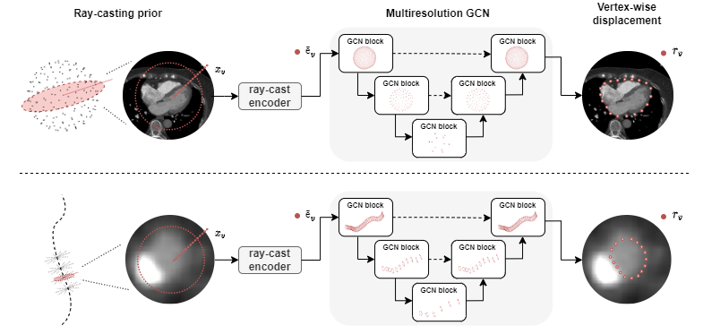

# World of Forms: Deformable Geometric Templates for 3D Surface Meshing

This repository contains the official implementation of the 2025 Medical Image Analysis paper "World of Forms: Deformable Geometric Templates for One-Shot Surface Meshing in Coronary CT Angiography". The framework enables data-efficient generation of 3D surface meshes from medical images using geometric priors.



## Project Overview

Traditional medical image segmentation typically involves a pipeline from image to voxel-based segmentation to surface meshes, often requiring large training datasets while making limited use of prior geometric knowledge. This approach may lead to topological inconsistencies and suboptimal performance in low-data regimes.

World of Forms addresses these challenges through:

1. **Geometric Priors**: Utilizing shape-specific coordinate systems:
   - **Spherical priors** for roughly spherical structures (heart chambers, pericardium)
   - **Tubular priors** for cylindrical structures (coronary arteries)

2. **Direct Mesh Generation**: Predicting displacements along ray-casts to generate anatomically accurate, topologically consistent meshes

3. **Data Efficiency**: Enabling one-shot learning through strong geometric inductive biases and pretraining strategies

## Repository Structure

```
WoF/
├── data/
│   ├── augmentation.py    # Data augmentation utilities for ray-cast sampling
│   └── datasets.py        # Dataset classes for different geometric priors
├── pretraining/
│   ├── model.py           # Masked autoencoder implementation for 3D spherical data
│   └── trainer.py         # Training utilities for self-supervised pretraining
├── surface_meshing/
│   ├── blocks.py          # Building blocks for graph neural networks
│   ├── losses.py          # Custom loss functions for surface prediction
│   ├── model.py           # Model definitions for GEM-CNN and GEM-UNet
│   └── trainer.py         # Training utilities for mesh generation
├── utils/
│   ├── icosahedron.py     # Utilities for spherical meshing via icosphere subdivision
│   ├── multi_planar_reformation.py # Utilities for tubular coordinate systems
│   ├── preprocessing.py   # Data preprocessing functions
│   └── read_write.py      # I/O utilities for medical images and meshes
├── main_pretrain.py       # Entry point for masked autoencoder pretraining
├── main_spherical.py      # Entry point for spherical mesh generation
├── main_tubular.py        # Entry point for tubular mesh generation
└── configs/               # Configuration files for different experiments
    ├── train_*.json       # Training configurations
    └── test_*.json        # Testing/inference configurations
```

## Dependencies

### Core Requirements
- Python 3.8+
- PyTorch 2.0+
- PyTorch Lightning 2.0+
- PyTorch Geometric 2.3+
- CUDA 11.7+ (for GPU acceleration)
- GEM-CNN
- vit-pytorch

### Medical Imaging Libraries
- SimpleITK
- VTK
- PyVista
- h5py

### Installation

1. Create a conda environment:
```bash
conda create -n wof python=3.8
conda activate wof
```

2. Install PyTorch and CUDA:
```bash
conda install pytorch torchvision torchaudio pytorch-cuda=11.7 -c pytorch -c nvidia
```

3. Install PyTorch Geometric:
```bash
conda install pyg -c pyg
```

4. Install PyTorch Lightning:
```bash
pip install lightning
```

5. Install medical imaging libraries:
```bash
conda install -c simpleitk simpleitk
conda install -c conda-forge vtk pyvista h5py
```

6. Install remaining dependencies:
```bash
pip install einops trimesh stl
```

## Datasets

The framework is evaluated on the following datasets:

> **Note:** The original work utilized datasets named "WholeHeartFull" (LV and LV myocardium), "PericardiumFull" (pericardium), "PretrainTAVI" (spherical pre-training), and "ASOCA" (coronary lumen). All datasets are expected to be in nnUNet raw dataset format, for which helper functions can be found in `preprocessing.py`. Within the Amsterdam UMC network, these datasets can be found at "R:/QIA/Users/Roel/data/nnUNet_raw/...". For internal use, Dataset007_ASOCA contains mpr images with edited reference segmentations (see train_ConvEncoder_GEMUNet_lumen_mpr.json).

### MM-WHS (Multi-Modality Whole Heart Segmentation)
- Used as an external test set for LV cavity and myocardium segmentation
- Contains end-diastolic images with whole heart reference segmentations
- Source: [MM-WHS Challenge](https://zmiclab.github.io/zxh/0/mmwhs/)

### ASOCA (Automated Segmentation Of Coronary Arteries)
- Contains CCTA scans of both healthy subjects and patients with coronary artery disease
- Includes coronary artery centerlines and lumen segmentations
- Source: [ASOCA Challenge](https://asoca.grand-challenge.org/)
- **Note:** In this repository, mpr images and references are generated on the fly during training and testing, while in the original work, references were edited to exclude bifurcating lumens and calcifications. This may lead to differences in performance, with notably more coarse mesh outputs.
- **TODO**: Add surface normal regularization to the lumen segmentation task.

## Data Preprocessing

The framework expects data in a specific format. To prepare your own data:

1. Convert data to nnUNet format:
```bash
python -c "from utils.preprocessing import asoca_to_nnunet; asoca_to_nnunet('/path/to/raw/asoca', '/path/to/output/DatasetXXX_ASOCA')"
```

2. Generate folds for training/validation:
```bash
python -c "from utils.preprocessing import make_folds, make_folds_asoca; make_folds('/path/to/Dataset001_WholeHeartFull'); make_folds_asoca('/path/to/DatasetXXX_ASOCA')"
```

3. Generate landmarks for spherical meshing:
```bash
python -c "from utils.preprocessing import generate_landmarks; generate_landmarks('/path/to/Dataset001_WholeHeartFull')"
```

4. Convert to HDF5 format for faster loading:
```bash
python -c "from utils.preprocessing import nnunet_to_hdf5; nnunet_to_hdf5('/path/to/Dataset001_WholeHeartFull'); nnunet_to_hdf5('/path/to/DatasetXXX_ASOCA', format='.nrrd')"
```

## Usage

### Self-supervised Pretraining (Optional)

For improved performance in the low-data regime, pretrain using the masked autoencoder for 3D spherical data:

```bash
python main_pretrain.py configs/train_MAE.json
```

### Training

#### Pericardium Segmentation (Spherical Prior)
```bash
python main_spherical.py configs/train_ConvEncoder_GEMUNet_pericardium.json
```

#### LV Myocardium Segmentation (Spherical Prior with Nested Boundary)
```bash
python main_spherical.py configs/train_ConvEncoder_GEMCNN_myocardium.json
```

#### Coronary Lumen Segmentation (Tubular Prior)
```bash
python main_tubular.py configs/train_ConvEncoder_GEMUNet_lumen.json
```

### Inference

#### Pericardium Inference
```bash
python main_spherical.py configs/test_ConvEncoder_GEMUNet_pericardium.json
```

#### LV Myocardium Inference
```bash
python main_spherical.py configs/test_ConvEncoder_GEMCNN_myocardium.json
```

#### Coronary Lumen Inference
```bash
python main_tubular.py configs/test_ConvEncoder_GEMUNet_lumen.json
```

### Configuration Parameters

Key configuration parameters include:

- **GENERAL**: General settings including mode (train/infer), name, and seed
- **DATA**: Dataset configuration including paths, geometric prior settings, and resolution parameters
- **MODEL**: Model architecture and parameters
- **OPTIMIZATION**: Training hyperparameters

## Output

The framework generates:

1. **STL meshes**: Ready for 3D visualization, computational fluid dynamics, or electrophysiological modeling
2. **NIfTI segmentations**: Binary masks corresponding to the generated meshes
3. **VTK files**: For visualization with error metrics (when ground truth is available)

Outputs are saved to:
```
./lightning_logs/{experiment_name}/{timestamp}/outputs/
```

## Geometric Priors

### Spherical Prior
For roughly spherical structures like the pericardium and heart chambers, an icosphere is used as a template mesh:

```json
"icosphere": {
  "bins": 256,
  "radius": 128,
  "subdivisions": 4
}
```

Rays are cast from a central seed point through each vertex of the icosphere, sampling intensity values along each ray.

### Tubular Prior
For coronary arteries, a cylindrical or tube template is used:

```json
"mpr_transform": {
  "ps": [127, 127],
  "ps_polar": [32, 48],
  "resample": false,
  "spacing": [0.1, 0.1, 0.5],
  "spacing_polar": [0.2, 0.13, 0.5]
}
```

Rays are cast from points along a centerline in radial directions to sample intensity values.

## Graph Neural Networks

The framework uses two types of graph neural networks:

1. **GEM-CNN**: A single-resolution gauge-equivariant mesh CNN that operates on the geometric prior
2. **GEM-UNet**: A multi-resolution GEM-CNN that operates at different subdivision levels of the template mesh

The gauge-equivariant design ensures invariance to the choice of reference frame and provides robust performance in one-shot learning scenarios.

## Citation

If you use this code in your research, please cite:

```
@article{van2025world,
  title={World of Forms: Deformable geometric templates for one-shot surface meshing in coronary CT angiography},
  author={van Herten, Rudolf LM and Lagogiannis, Ioannis and Wolterink, Jelmer M and Bruns, Steffen and Meulendijks, Eva R and Dey, Damini and de Groot, Joris R and Henriques, Jos{\'e} P and Planken, R Nils and Saitta, Simone and others},
  journal={arXiv preprint arXiv:2409.11837},
  year={2025}
}
```
## License

This project is licensed under the GPL3 License - see the LICENSE file for details.